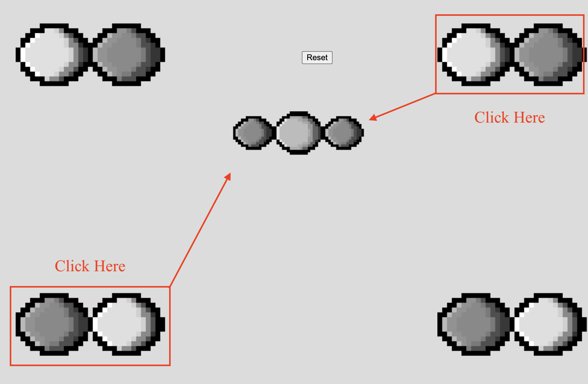

# Orbital Mixing Activity

This is a project for COMP225 - Software Design and Development. The activity is designed for General Chemistry students in university (or advanced high schoolers) who wish to learn more about bonding theory and how different atomic orbitals interact. In effect, this project aims to provide a visualization of the constructive and destructive overlap in regions of an orbital's wavefunction for diatomics (molecules with two atoms). The wavefunction is an idea from quantum mechanics that describes the probability distribution of the location of a particle, in this case, we are talking about electrons.

This web app is built with the p5.js graphics library. I designed the sprites using Piskel. Ideally, I will rework the graphics using WebGL so we can have a more faithful representation of the orbitals in 3D as opposed to 2D.

# Current State of the Application

This is a preview of the top 2 pairs of orbitals on the webpage. A user can click on two orbitals and a mixed orbital will appear in the center. The example shown is the constructive overlap between two $P_x$ orbitals on the internuclear axis.

